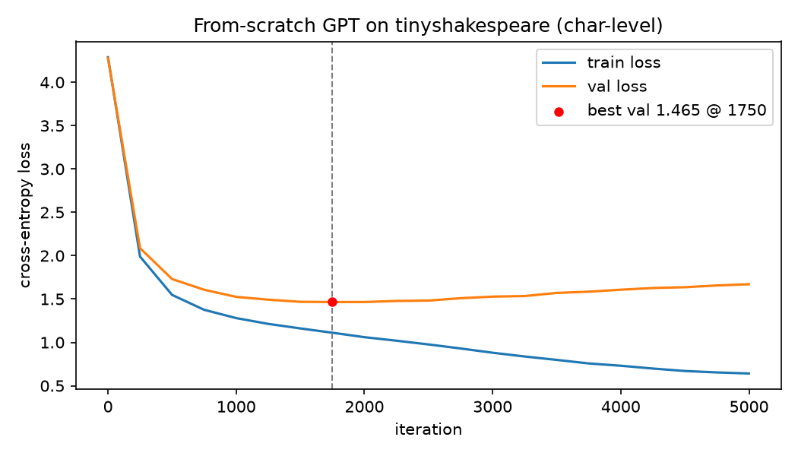

# Forge

Training an agentic LLM's tool-use policy with reinforcement learning on
verifiable-reward tasks — arithmetic requiring a calculator tool, coding
problems checkable by running tests, and multi-hop QA answerable via a
search tool. Rewards come from real programmatic verifiers, not a learned
preference model, so nothing here can be gamed the way an eval score can.

This repo makes two separate claims, kept architecturally and narratively
distinct throughout:

1. **A small transformer language model built from scratch** — a standalone
   proof of understanding transformer internals (attention, positional
   encoding, the training loop). It does not feed the agent below.
2. **An agent whose tool-use policy is trained with RL (GRPO)** — the real
   system, backed by a small pretrained open-weight model (Qwen2.5), not by
   the from-scratch model in (1). An 8GB GPU cannot pretrain a model capable
   enough to be a useful agent backbone.

## Status

Work in progress, built incrementally. Sections below are added only once
the corresponding module exists and has been run for real.

## Module 1: from-scratch transformer

`transformer_scratch/` — a GPT-style decoder-only transformer (causal
self-attention, learned positional embeddings, pre-LN residual blocks) built
directly on `torch.nn`, trained on the character-level tinyshakespeare
corpus. Exists solely to demonstrate transformer internals are understood
from scratch; it is not used anywhere else in this project.

### Architecture

| | |
| --- | --- |
| Parameters | 10.77M |
| Layers / heads / embedding | 6 / 6 / 384 |
| Context length | 256 characters |
| Vocabulary | 65 characters (built from the corpus, no external tokenizer) |
| Dropout | 0.2 |

Attention, the MLP block, positional embeddings and the training loop are
written directly against `torch.nn` — no `transformers` import anywhere in
this module. Token embedding and output head share weights.

### Training

Trained on tinyshakespeare (1,115,394 characters, 90/10 train/val split) on
a single RTX 4060 Laptop GPU: 5000 iterations, batch 64, AdamW, bf16
autocast, learning rate 1e-3 with 100-iteration linear warmup then cosine
decay to 1e-4, gradient clipping at 1.0. **Wall clock: 15.0 minutes**, peak
3033 MiB VRAM.

### Results

| metric | value |
| --- | --- |
| **Best validation loss** | **1.4652** (iteration 1750) |
| Training loss at that point | 1.1114 |
| Final validation loss (iter 4999) | 1.6703 |
| Final training loss (iter 4999) | 0.6411 |



**The model overfits after iteration ~1750**, and the curve above shows it
plainly: validation loss bottoms out at 1.4652 and then climbs for the
remaining 3250 iterations while training loss keeps falling to 0.6411. This
is expected — 5000 iterations at batch 64 is roughly 73 epochs over a 1.1M
character corpus, so the ceiling here is memorisation, not data.

Two honest consequences:

- The released checkpoint is the **best-validation** one (iteration 1750),
  not the final one. Keeping the final model would have shipped something
  0.205 nats worse.
- 5000 iterations was more than this setup needed. The validation minimum
  arrives around iteration 1750–2000; the remaining ~9 minutes of compute
  bought nothing but overfitting. Left as-is because it makes the
  overfitting visible rather than hiding it behind an early stop.

### Sample output

Generated from the best-validation checkpoint (temperature 0.8, unconditioned):

```text
AUTOLYCUS:
And the lower of much a dufficious hands
at once to make them; Or, and entreats
guides like a life to the merely territ, my
first soul to fight find their harms. My friends sit their
treacherous enemy is an old sins or as mine eagle
My partner doth not between my sister news with them;

DUKE VINCENTIO:
Heavens bring the read in his noble kind heart;
And being and ancient villany of our course,
Good sooth, as if I cannot be assured
To burn his bed back, in pointy a bones
```

This is a fair representative draw, not a best-of-N pick. The model has
learned the *shape* of the corpus — real speaker headings, blank-verse line
breaks, largely well-formed English words and plausible local syntax — but
it is not semantically coherent, and it invents words ("dufficious",
"territ"). That is the expected ceiling for a 10.77M-parameter character-level
model at a validation loss of ~1.47, and it is the honest limit of what this
module claims.

### A note on precision

The first attempt at this run was fp32 and hard-crashed the machine
(Kernel-Power 41, no crash dump — a power cut, not a driver fault). Measuring
before re-running turned out to matter:

| config | peak power | peak temp | peak VRAM | µs/token |
| --- | --- | --- | --- | --- |
| fp32, batch 32 | 115.8 W | 78 °C | 2287 MiB | 15.5 |
| bf16, batch 32 | 82.6 W | 66 °C | 1731 MiB | 9.0 |
| bf16, batch 64 | 81.4 W | 66 °C | 3033 MiB | 9.6 |

bf16 autocast draws ~30% less power, runs 12 °C cooler and is ~1.6x faster
per token than fp32. Batch size barely moves peak power (81.4 W at batch 64
vs 82.6 W at batch 32) because the GPU is already saturated at batch 32 — so
gradient accumulation, which would have been the usual way to keep effective
batch size up under a power ceiling, was measured to be unnecessary here and
was not used.

### Reproducing

```bash
python transformer_scratch/train.py      # ~15 min on an RTX 4060
python transformer_scratch/generate.py --save
pytest transformer_scratch/tests -q      # 6 tests
```

The corpus downloads automatically on first run. Tests cover attention/MLP/
block output shapes, an actual causal-masking correctness check (perturbing a
future token must not change earlier positions' outputs), and an
overfit-one-batch sanity check.
